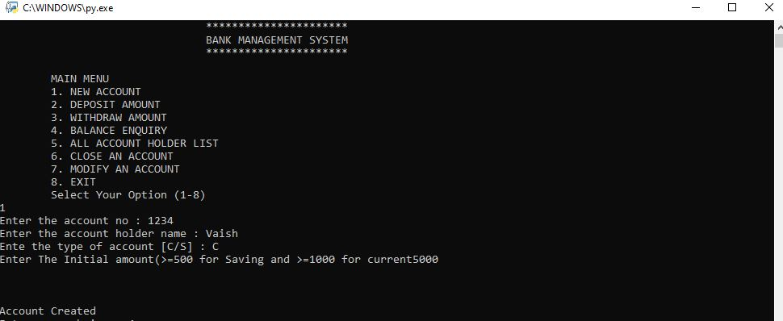
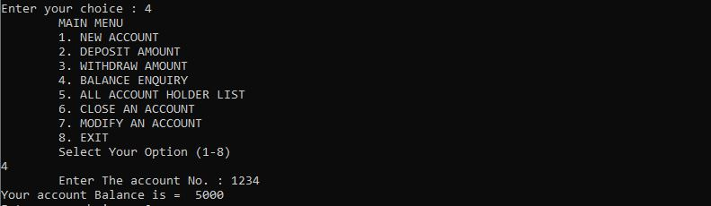

# Banking-System
A bank management system created using python. 
This application allows users to:
<ol>Create a new account</ol>
<ol>Withdraw Money</ol>
<ol>Deposit money</ol>
<ol>Check account details</ol>
<ol>Close an account</ol>
<ol>Modify account</ol>
<ol>List all account holders</ol> 

